Plots - Lithic analysis from three sites: Balver Höhle, Buhlen & Ramioul
================
Lisa Schunk
2021-01-27

  - [Goal of the script](#goal-of-the-script)
  - [Load packages](#load-packages)
  - [Get name, path and information of the
    file](#get-name-path-and-information-of-the-file)
  - [Load data into R object](#load-data-into-r-object)
  - [Data analsysis - plots](#data-analsysis---plots)
      - [Histogram](#histogram)
          - [Histogram dimensions -
            Keilmesser](#histogram-dimensions---keilmesser)
          - [Histogram dimensions - Pradnik
            scraper](#histogram-dimensions---pradnik-scraper)
          - [Histogram dimension - Lateral sharpening
            spall](#histogram-dimension---lateral-sharpening-spall)
      - [Scatterplot](#scatterplot)
          - [Length-width ratio](#length-width-ratio)
      - [Barplot](#barplot)
          - [Morphotype](#morphotype)
      - [Barplot](#barplot-1)
          - [Raw material](#raw-material)
      - [Barplot](#barplot-2)
          - [Morphology back](#morphology-back)
      - [Barplot](#barplot-3)
          - [Pradnik method](#pradnik-method)
      - [Diverging barplot](#diverging-barplot)
          - [Lateralisation](#lateralisation)
      - [Barplot](#barplot-4)
          - [Barplot lateral resharpening spall
            type](#barplot-lateral-resharpening-spall-type)
      - [Ternary plot](#ternary-plot)
          - [Perimeter](#perimeter)
  - [Show plot files information](#show-plot-files-information)
  - [sessionInfo() and RStudio
    version](#sessioninfo-and-rstudio-version)

-----

# Goal of the script

This script reads the xlsx file (derived data) containing all the
information gained through a lithic analysis.  
The script will:

1.  Reads the xlsx file
2.  Plots all relevant variables in various combinations
3.  Saves the plot as PDFs

<!-- end list -->

``` r
dir_in <-  "analysis/all_Sites/derived_data/"
dir_out <- "analysis/all_sites/plots/"
```

Raw data must be located in “analysis/all\_Sites/derived\_data/”.  
Formatted data will be saved in “analysis/all\_sites/plots/”. The knit
directory for this script is the project directory.

-----

# Load packages

``` r
library(openxlsx)
library(readxl)
library(R.utils)
library(tools)
library(chron)
library(ggplot2)
library(wesanderson)
library(dplyr)
library(ggsci)
```

-----

# Get name, path and information of the file

``` r
data_file <- list.files(dir_in, pattern = "\\.xlsx$", full.names = TRUE)
md5_in <- md5sum(data_file)
info_in <- data.frame(files = basename(names(md5_in)), checksum = md5_in, 
                      row.names = NULL)
```

The checksum (MD5 hashes) of the imported files are:

``` 
                    files                         checksum
1 all_sites_analysis.xlsx 2f078a742c79d7d9eec714dfe6a4c763
```

# Load data into R object

``` r
imp_data <- read.xlsx(xlsxFile = data_file, sheet = 1, startRow = 1, colNames = TRUE,
                      rowNames = FALSE, skipEmptyRows = FALSE) 
```

# Data analsysis - plots

## Histogram

### Histogram dimensions - Keilmesser

``` r
# Load data sheet Keilmesser 
KM_dim <- read.xlsx(xlsxFile = data_file, sheet = 3) 
# removes incomplete artefacts 
KM_dim <- KM_dim[ , ] %>% arrange(artefact.state)
KM.tip_dim <- KM_dim[-c(279, 316:330), ]

# Keilmesser length 
# Calculates the mean value for the plot and ascribes the N value 
mean_length <- mean(KM.tip_dim$length, na.rm = TRUE)
n <- doBy::summaryBy(length ~ artefact.state, data = KM.tip_dim, FUN = length)
tag <- gsub(pattern = "_", replacement = " ", paste0(n[[1]], " (n = ", n[[2]], ")"))

# Histogram Keilmesser length
KM.length <- ggplot(KM.tip_dim, aes(x = length, fill = artefact.state)) + 
             geom_histogram(binwidth = 1) +
             labs(x = "length [mm]", y = "n", title = "", fill = "artefact state", 
                  size = 12) +
             theme_classic() +
             geom_vline(aes(xintercept = mean_length), linetype="dashed", size = 1) +
             geom_text(aes(y = mean_length, x = 67, label = round(mean_length, 1)), 
                       nudge_y = -38) +
             scale_fill_manual(values = wes_palette(n = 2, name = "Zissou1"), labels = tag) 

print(KM.length)
```

    Error in FUN(X[[i]], ...): object 'mean_length' not found

``` r
file_out <- paste0(file_path_sans_ext(info_in[["file"]]), "KM.length", ".pdf")
ggsave(filename = file_out, plot = KM.length, path = dir_out, device = "pdf", width = 170, height = 250, units = "mm")
```

    Error in FUN(X[[i]], ...): object 'mean_length' not found

``` r
# Keilmesser width
# Calculates the mean value for the plot and ascribes the N value 
mean_width <- mean(KM.tip_dim$width, na.rm = TRUE)
n <- doBy::summaryBy(width ~ artefact.state, data = KM.tip_dim, FUN = length)
tag <- gsub(pattern = "_", replacement = " ", paste0(n[[1]], " (n = ", n[[2]], ")"))

# Histogram Keilmesser width
KM.width <- ggplot(KM.tip_dim, aes(x = width, fill = artefact.state)) + 
            geom_histogram(binwidth = 1) +
            labs(x = "width [mm]", y = "n", title = "", fill = "artefact state", 
                 size = 12) +
            theme_classic() +
            geom_vline(aes(xintercept = mean_width), linetype = "dashed", size = 1) +
            geom_text(aes(y = mean_length, x = 42, label = round(mean_width, 1)), 
                      nudge_y = -34) +
            scale_fill_manual(values = wes_palette(n = 2, name = "Zissou1"), labels = tag) 

print(KM.width) 
```

    Error in FUN(X[[i]], ...): object 'mean_width' not found

``` r
file_out <- paste0(file_path_sans_ext(info_in[["file"]]), "KM.width", ".pdf")
ggsave(filename = file_out, plot = KM.width, path = dir_out, device = "pdf", width = 170, height = 250, units = "mm")
```

    Error in FUN(X[[i]], ...): object 'mean_width' not found

``` r
# Keilmesser thickness
# Calculates the mean value for the plot and ascribes the N value 
mean_thickness <- mean(KM.tip_dim$thickness, na.rm = TRUE)
n <- doBy::summaryBy(thickness ~ artefact.state, data = KM_dim, FUN = length)
tag <- gsub(pattern = "_", replacement = " ", paste0(n[[1]], " (n = ", n[[2]], ")"))

# Histogram Keilmesser thickness 
KM.thickness  <- ggplot(KM.tip_dim, aes(y = thickness, fill = artefact.state)) + 
                 geom_histogram(binwidth = 0.8) +
                 labs(y = "thickness [mm]", x = "n", title = "", fill = "artefact state",
                      size = 12) +
                 theme_classic() +
                 geom_hline(aes(yintercept = mean_thickness), linetype = "dashed", 
                            size = 1) +
                 geom_text(aes(y = mean_thickness, x = 37.5, label = round(mean_thickness,
                      1)), nudge_y = 1) +
                 scale_fill_manual(values = wes_palette(n = 2, name = "Zissou1"), 
                                   labels = tag) 

print(KM.thickness) 
```

    Error in FUN(X[[i]], ...): object 'mean_thickness' not found

``` r
file_out <- paste0(file_path_sans_ext(info_in[["file"]]), "KM.thickness", ".pdf")
ggsave(filename = file_out, plot = KM.thickness, path = dir_out, device = "pdf", 
       width = 250, height = 170, units = "mm")
```

    Error in FUN(X[[i]], ...): object 'mean_thickness' not found

``` r
# Keilmesser Back 
# Load data sheet Keilmesser thickness back 
KM_back <- read.xlsx(xlsxFile = data_file, sheet = 13) 
KM_back <- KM_back[-c(279, 316:330), ]


# Calculates the mean value for the plot and ascribes the N value 
mean_KM_back <- mean(KM_back$thickness.back, na.rm = TRUE)
n <- doBy::summaryBy(thickness.back ~ artefact.state, data = KM_back, FUN = length)
tag <- gsub(pattern = "_", replacement = " ", paste0(n[[1]], " (n = ", n[[2]], ")"))

# Histogram Keilmesser thickness back  
KM.back  <- ggplot(KM_back, aes(y = thickness.back, fill = artefact.state)) + 
                 geom_histogram(binwidth = 0.8) +
                 labs(x = "thickness [mm]", y = "n", title = "", fill = "artefact state",
                      size = 12) +
                 theme_classic() +
                 geom_hline(aes(yintercept = mean_KM_back), linetype = "dashed", 
                            size = 1) +
                 geom_text(aes(y = mean_KM_back, x = 28.5, label = round(mean_KM_back, 1)),
                           nudge_y = -0.7) +
                 scale_fill_manual(values = wes_palette(n = 3, name = "Zissou1"), 
                                   labels = tag) 

print(KM.back) 
```

    Error in FUN(X[[i]], ...): object 'mean_KM_back' not found

<!-- -->

``` r
file_out <- paste0(file_path_sans_ext(info_in[["file"]]), "KM.back", ".pdf")
ggsave(filename = file_out, plot = KM.back, path = dir_out, device = "pdf", width = 250, height = 170, units = "mm")
```

    Error in FUN(X[[i]], ...): object 'mean_KM_back' not found

### Histogram dimensions - Pradnik scraper

``` r
# Load data sheet Pradnik scraper  
PS_dim <- read.xlsx(xlsxFile = data_file, sheet = 4) 

# Pradnik scraper length 
# Calculates the mean value for the plot and ascribes the N value 
mean_PS_length <- mean(PS_dim$length, na.rm = TRUE)
n <- doBy::summaryBy(length ~ artefact.state, data = PS_dim, FUN = length)
tag <- gsub(pattern = "_", replacement = " ", paste0(n[[1]], " (n = ", n[[2]], ")"))

# Histogram Pradnik scraper length
PS.length <- ggplot(PS_dim, aes(x = length, fill = artefact.state)) + 
             geom_histogram(binwidth = 1) +
             labs(x = "length [mm]", y = "n", title = "", fill = "artefact state", 
                  size = 12) +
             theme_classic() +
             geom_vline(aes(xintercept = mean_PS_length), linetype = "dashed", 
                        size = 1) +
             geom_text(aes(y = mean_PS_length, x = 52, label = round(mean_PS_length, 1)),
                       nudge_y = -40.4) +
             scale_fill_manual(values = wes_palette(n = 1, name = "BottleRocket1"), 
                               labels = tag) 

print(PS.length)
```

    Error in FUN(X[[i]], ...): object 'mean_PS_length' not found

``` r
file_out <- paste0(file_path_sans_ext(info_in[["file"]]), "PS.length", ".pdf")
ggsave(filename = file_out, plot = PS.length, path = dir_out, device = "pdf", width = 170, height = 250, units = "mm")
```

    Error in FUN(X[[i]], ...): object 'mean_PS_length' not found

``` r
# Pradnik scraper width 
# Calculates the mean value for the plot and ascribes the N value 
mean_PS_width <- mean(PS_dim$width, na.rm = TRUE)
n <- doBy::summaryBy(width ~ artefact.state, data = PS_dim, FUN = length)
tag <- gsub(pattern = "_", replacement = " ", paste0(n[[1]], " (n = ", n[[2]], ")"))

# Histogram Pradnik scraper width
PS.width <- ggplot(PS_dim, aes(x = width, fill = artefact.state)) + 
            geom_histogram(binwidth = 1) +
            labs(x = "width [mm]", y = "n", title = "", fill = "artefact state", 
                 size = 12) +
            theme_classic() +
            geom_vline(aes(xintercept = mean_PS_width), linetype="dashed", size = 1) +
            geom_text(aes(y = mean_PS_width, x = 35, label = round(mean_PS_width, 2)),
                      nudge_y = -24.1) +
            scale_fill_manual(values = wes_palette(n = 1, name = "BottleRocket1"), 
                              labels = tag) 
 
print(PS.width)
```

    Error in FUN(X[[i]], ...): object 'mean_PS_width' not found

``` r
file_out <- paste0(file_path_sans_ext(info_in[["file"]]), "PS.width", ".pdf")
ggsave(filename = file_out, plot = PS.width, path = dir_out, device = "pdf", width = 170, height = 250, units = "mm")
```

    Error in FUN(X[[i]], ...): object 'mean_PS_width' not found

``` r
# Pradnik scraper thickness
# Calculates the mean value for the plot and ascribes the n value 
mean_PS_thickness <- mean(PS_dim$thickness, na.rm = TRUE)
n <- doBy::summaryBy(thickness ~ artefact.state, data = PS_dim, FUN = length)
tag <- gsub(pattern = "_", replacement = " ", paste0(n[[1]], " (n = ", n[[2]], ")"))

# Histogram Pradnik scraper thickness 
PS.thickness <- ggplot(PS_dim, aes(y = thickness, fill = artefact.state)) + 
                geom_histogram(binwidth = 1) +
                labs(y = "thickness [mm]", x = "n", title = "", fill = "artefact state",
                     size = 12) +
                theme_classic() +
                geom_hline(aes(yintercept = mean_PS_thickness), linetype = "dashed", 
                           size = 1) +
                geom_text(aes(y = mean_PS_thickness, x = 6.8, 
                              label = round(mean_PS_thickness, 1)), nudge_y = -0.5) +
                scale_fill_manual(values = wes_palette(n = 1 , name = "BottleRocket1"),
                                  labels = tag) 

print(PS.thickness)
```

    Error in FUN(X[[i]], ...): object 'mean_PS_thickness' not found

``` r
file_out <- paste0(file_path_sans_ext(info_in[["file"]]), "PS.thickness", ".pdf")
ggsave(filename = file_out, plot = PS.thickness, path = dir_out, device = "pdf", width = 250, height = 170, units = "mm")
```

    Error in FUN(X[[i]], ...): object 'mean_PS_thickness' not found

``` r
# Back Pradnik scraper thickness
# Load data sheet Pradnik scraper thickness back 
PS_back <- read.xlsx(xlsxFile = data_file, sheet = 14) 

# Calculates the mean value for the plot and ascribes the n value 
mean_PS_back <- mean(PS_back$thickness.back, na.rm = TRUE)
n <- doBy::summaryBy(thickness.back ~ artefact.state, data = PS_back, FUN = length)
tag <- gsub(pattern = "_", replacement = " ", paste0(n[[1]], " (n = ", n[[2]], ")"))

# Histogram Pradnik scraper thickness back  
PS.back  <- ggplot(PS_back, aes(y = thickness.back, fill = artefact.state)) + 
                 geom_histogram(binwidth = 0.8) +
                 labs(y = "thickness [mm]", x = "n", title = "", fill = "artefact state",
                      size = 12) +
                 theme_classic() +
                 geom_hline(aes(yintercept = mean_PS_back), linetype = "dashed", 
                            size = 1) +
                 geom_text(aes(y = mean_PS_back, x = 6.8, label = round(mean_PS_back, 1)),
                           nudge_y = -0.5) +
                 scale_fill_manual(values = wes_palette(n = 3, name = "BottleRocket1"),
                                   labels = tag) 

print(PS.back) 
```

    Error in FUN(X[[i]], ...): object 'mean_PS_back' not found

<!-- -->

``` r
file_out <- paste0(file_path_sans_ext(info_in[["file"]]), "PS.back", ".pdf")
ggsave(filename = file_out, plot = PS.back, path = dir_out, device = "pdf", width = 250, height = 170, units = "mm")
```

    Error in FUN(X[[i]], ...): object 'mean_PS_back' not found

### Histogram dimension - Lateral sharpening spall

``` r
# Load data sheet lateral sharpening spall  
LSS_dim <- read.xlsx(xlsxFile = data_file, sheet = 5) 
# removes incomplete artefacts 
LSS_dim <-LSS_dim[ , ] %>% arrange(artefact.state)
LSS_dim <- LSS_dim[-c(147:159), ]


# Lateral sharpening spall length 
# Calculates the mean value for the plot and ascribes the n value 
mean_LSS_length <- mean(LSS_dim$length, na.rm = TRUE)
n <- doBy::summaryBy(length ~ artefact.state, data = LSS_dim, FUN = length)
tag <- gsub(pattern = "_", replacement = " ", paste0(n[[1]], " (n = ", n[[2]], ")"))
  
# Histogram lateral sharpening spall length
LSS.length <- ggplot(LSS_dim, aes(x = length, fill = artefact.state)) + 
              geom_histogram(binwidth = 1) +
              labs(x = "length [mm]", y = "n", title = "", fill = "artefact state", 
                   size = 12) +
              theme_classic() +
              geom_vline(aes(xintercept = mean_LSS_length), linetype = "dashed", 
                         size = 1) +
              geom_text(aes(y = mean_LSS_length, x = 35, label = round(mean_LSS_length,
                          1)), nudge_y = -17.7) +
              scale_fill_manual(values = wes_palette(n = 1, name = "Chevalier1"), 
                                labels = tag) 

print(LSS.length)
```

    Error in FUN(X[[i]], ...): object 'mean_LSS_length' not found

``` r
file_out <- paste0(file_path_sans_ext(info_in[["file"]]), "LSS.length", ".pdf")
ggsave(filename = file_out, plot = LSS.length, path = dir_out, device = "pdf", width = 170, height = 250, units = "mm")
```

    Error in FUN(X[[i]], ...): object 'mean_LSS_length' not found

``` r
# Lateral sharpening spall width 
# Calculates the mean value for the plot and ascribes the n value 
mean_LSS_width <- mean(LSS_dim$width, na.rm = TRUE)
n <- doBy::summaryBy(width ~ artefact.state, data = LSS_dim, FUN = length)
tag <- gsub(pattern = "_", replacement = " ", paste0(n[[1]], " (n = ", n[[2]], ")"))

# Histogram lateral sharpening spall width
LSS.width <- ggplot(LSS_dim, aes(x = width, fill = artefact.state)) + 
             geom_histogram(binwidth = 1) +
             labs(x = "width [mm]", y = "n", title = "", fill = "artefact state", 
                  size = 12) +
             theme_classic() +
             geom_vline(aes(xintercept = mean_LSS_width), linetype = "dashed", 
                        size = 1) +
             geom_text(aes(y = mean_LSS_width, x = 19.8, label = round(mean_LSS_width, 1)),
                       nudge_y = -1.55) +
             scale_fill_manual(values = wes_palette(n = 4, name = "Chevalier1"), 
                               labels = tag) 

print(LSS.width)
```

    Error in FUN(X[[i]], ...): object 'mean_LSS_width' not found

``` r
file_out <- paste0(file_path_sans_ext(info_in[["file"]]), "LSS.width", ".pdf")
ggsave(filename = file_out, plot = LSS.width, path = dir_out, device = "pdf", width = 170, height = 250, units = "mm")
```

    Error in FUN(X[[i]], ...): object 'mean_LSS_width' not found

``` r
# Lateral sharpening spall thickness
# Calculates the mean value for the plot and ascribes the n value 
mean_LSS_thickness <- mean(LSS_dim$thickness, na.rm = TRUE)
n <- doBy::summaryBy(thickness ~ artefact.state, data = LSS_dim, FUN = length)
tag <- gsub(pattern = "_", replacement = " ", paste0(n[[1]], " (n = ", n[[2]], ")"))

# Histogram lateral sharpening spall thickness 
LSS.thickness <- ggplot(LSS_dim, aes(y = thickness, fill = artefact.state)) + 
                 geom_histogram(binwidth = 0.5) +
                 labs(y = "thickness[mm]", x = "n", title = "", fill = "artefact state",
                      size = 12) +
                 theme_classic() + 
                 geom_hline(aes(yintercept = mean_LSS_thickness), linetype = "dashed", 
                            size = 1) +
                 geom_text(aes(y = mean_LSS_thickness, x = 23.9, label =
                                 round(mean_LSS_thickness, 2)), nudge_y = -0.3) +
                 scale_fill_manual(values = wes_palette(n = 4, name = "Chevalier1"), 
                                   labels = tag) 

print(LSS.thickness)
```

    Error in FUN(X[[i]], ...): object 'mean_LSS_thickness' not found

<!-- -->

``` r
file_out <- paste0(file_path_sans_ext(info_in[["file"]]), "LSS.thickness", ".pdf")
ggsave(filename = file_out, plot = LSS.thickness, path = dir_out, device = "pdf", width = 250, height = 170, units = "mm")
```

    Error in FUN(X[[i]], ...): object 'mean_LSS_thickness' not found

## Scatterplot

### Length-width ratio

``` r
# Load data sheet Keilmesser 
KM_dim <- read.xlsx(xlsxFile = data_file, sheet = 3) 
KM_dim <- KM_dim[ , ] %>% arrange(artefact.state)
KM_comp_dim <- KM_dim[-c(279:330 ), ]

# Keilmesser length VS width 
# Ascribes the n value 
n <- doBy::summaryBy(width + length ~ site, data = KM_comp_dim, FUN = length)
tag <- gsub(pattern = "_", replacement = " ", paste0(n[[1]], " (n = ", n[[2]], ")"))

# Scatterplot Keilmesser (complete + tip) length VS width 
KM.length_width <- ggplot(KM_comp_dim, aes(y = length, x = width, fill = site)) +
                   geom_point(size = 3, shape = 21) +
                   labs(y = "length [mm]", x = "width [mm]", title = "", fill = "", 
                        size = 12) +
                   xlim(0, 160) + ylim(0, 160) +
                   theme_classic() +
                   scale_fill_manual(values = wes_palette(n = 3, name = "FantasticFox1",
                                    type = "continuous"), labels = tag) 


print(KM.length_width)
```

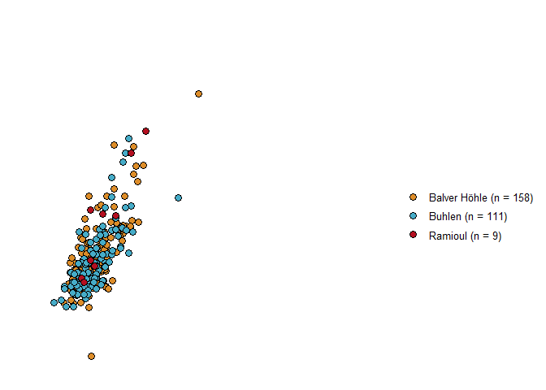<!-- -->

``` r
file_out <- paste0(file_path_sans_ext(info_in[["file"]]), "KM.length_width", ".pdf")
ggsave(filename = file_out, plot = KM.length_width, path = dir_out, device = "pdf",
       width = 170, height = 250, units = "mm")


# Keilmesser complete + tips length vs width  
# Define the rows with complete Keilmesser and Keilmesser tips 
KM_comp.tip_dim <- KM_dim[-c(279, 316:330), ]

# Ascribes the n value 
n <- doBy::summaryBy(length + width ~ site, data = KM_comp.tip_dim, FUN = length)
tag <- gsub(pattern = "_", replacement = " ", paste0(n[[1]], " (n = ", n[[2]], ")"))

# Scatterplot Keilmesser (complete + tip) length VS width 
KM.tip.length_width <- ggplot(KM_comp.tip_dim, aes(y = length, x = width, colour = 
                                site, shape = artefact.state)) +
                   geom_point(size = 2) +
                   scale_colour_manual(values = wes_palette(n = 3, name = "FantasticFox1",
                                        type = "continuous"), labels = tag) +
                   labs(y = "length [mm]", x = "width [mm]", title = "", fill = "", 
                        size = 12) +
                   xlim(0, 160) + ylim(0, 160) +
                   theme_classic() 
                    

print(KM.tip.length_width)
```

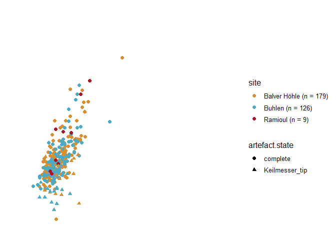<!-- -->

``` r
file_out <- paste0(file_path_sans_ext(info_in[["file"]]), "KM.tip.length_width", ".pdf")
ggsave(filename = file_out, plot = KM.tip.length_width, path = dir_out, device = "pdf", width = 170, height = 250, units = "mm")


# Pradnik scraper length VS width 
# Ascribes the n value 
n <- doBy::summaryBy(length + width ~ site, data = PS_dim, FUN = length)
tag <- gsub(pattern = "_", replacement = " ", paste0(n[[1]], " (N = ", n[[2]], ")"))

# Scatterplot Pradnik scraper length VS width 
PS.length_width <- ggplot(PS_dim, aes(y = length, x = width, fill = site)) +
                   geom_point(size = 3, shape = 21) +
                   labs(y = "length [mm]", x = "width [mm]", title = "",fill = " ", 
                        size = 12) +
                   xlim(0, 80) + ylim(0, 80) +
                   theme_classic() +
                   scale_fill_manual(values = wes_palette(n = 3, name = "Darjeeling1"),
                                     labels = tag) 

print(PS.length_width)
```

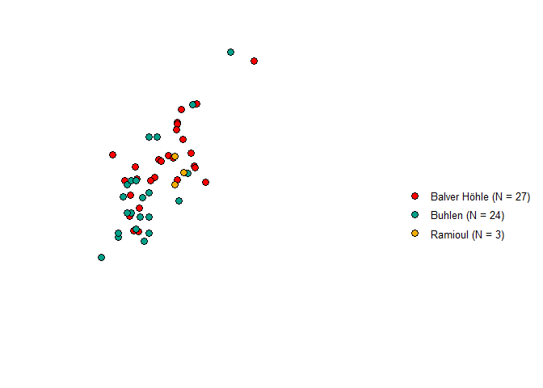<!-- -->

``` r
file_out <- paste0(file_path_sans_ext(info_in[["file"]]), "PS.length_width", ".pdf")
ggsave(filename = file_out, plot = PS.length_width, path = dir_out, device = "pdf",
       width = 170, height = 250, units = "mm")


# Lateral sharpening spall length VS width 
# Defines only the rows with complete LSS  
LSS_dim <- LSS_dim[ , ] %>% arrange(artefact.state)
LSS.comp_dim <- LSS_dim[1:146, ]

# Lateral sharpening spall length VS width 
# Ascribes the n value 
n <- doBy::summaryBy(length + width ~ site, data = LSS.comp_dim, FUN = length)
tag <- gsub(pattern = "_", replacement = " ", paste0(n[[1]], " (n = ", n[[2]], ")"))

# Scatterplot lateral sharpening spall length VS width 
LSS.length_width <- ggplot(LSS.comp_dim, aes(y = length, x = width, fill = site)) +
                    geom_point(size = 3, shape = 21) +
                    labs(y = "length [mm]", x = "width [mm]", title = "", fill = "", 
                         size = 12) +
                    xlim(0, 65) + ylim(0, 65) +
                    theme_classic() +
                    scale_fill_manual(values = wes_palette(n = 2, name = "Chevalier1"),
                                      labels = tag) 

print(LSS.length_width)
```

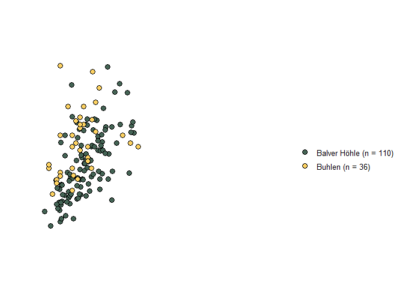<!-- -->

``` r
file_out <- paste0(file_path_sans_ext(info_in[["file"]]), "LSS.length_width", ".pdf")
ggsave(filename = file_out, plot = LSS.length_width, path = dir_out, device = "pdf", 
       width = 170, height = 250, units = "mm")


# Keilmesser (complete) + Pradnik scraper length VS width
# Load data sheet dimensions  
dim <- read.xlsx(xlsxFile = data_file, sheet = 2)
dim <- dim[ , ] %>% arrange(artefact.state)
# Defines only the relevant rows 
KM.PS_dim <- dim[c(4:281, 428:481), ]  

# Ascribes the n value 
n <- doBy::summaryBy(length + width ~ technological.class, data = KM.PS_dim, FUN = length)
tag <- gsub(pattern = "_", replacement = " ", paste0(n[[1]], " (n = ", n[[2]], ")"))


KM.PS.length_width <- ggplot(KM.PS_dim, aes(y = length, x = width, fill = technological.class)) +
                      geom_point(size = 3, shape = 21) +
                      labs(y = "length [mm]", x = "width [mm]", title = "",
                           fill = "artefact category", size = 12) +
                      xlim(0, 150) + ylim(0, 150) +
                      theme_classic() +
                      scale_fill_manual(values = wes_palette(n = 3, name = "FantasticFox1",
                                            type = "continuous"), labels = tag) 

print(KM.PS.length_width)
```

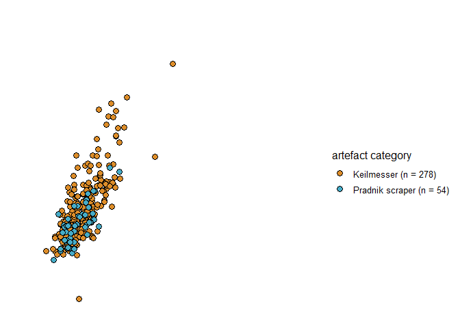<!-- -->

``` r
file_out <- paste0(file_path_sans_ext(info_in[["file"]]), "KM.PS.length_width", ".pdf")
ggsave(filename = file_out, plot = KM.PS.length_width, path = dir_out, device = "pdf", width = 170, height = 250, units = "mm")
 

# Keilmesser (complete): length-width combined with morpho type
# Load data sheet Keilmesser morpho type 
KM_morpho.type <- read.xlsx(xlsxFile = data_file, sheet = 15)
# Arranges the data and defines only the relevant rows
KM_morpho.type <- KM_morpho.type[ , ] %>% arrange(artefact.state)
KM_morpho.type <- KM_morpho.type[-c(279:330), ] 
KM_morpho.type <- KM_morpho.type[ , ] %>% arrange(morpho.type)
KM_morpho.type <- KM_morpho.type[-c(273:278), ]

# Ascribes the N value 
n <- doBy::summaryBy(length + width ~ morpho.type, data = KM_morpho.type, FUN = length)
tag <- gsub(pattern = "_", replacement = " ", paste0(n[[1]], " (n = ", n[[2]], ")"))


# Scatterplot Keilmesser (complete): length-width combined with morpho type 
KM.width_length_morpho <- ggplot(KM_morpho.type, aes(y = length, x = width, 
                                  fill = morpho.type)) +
                      geom_point(size = 2, shape = 21) +
                      labs(y = "length [mm]", x = "width [mm]", title = "", 
                           fill = "morpho type", size = 12) +
                      xlim(0, 160) + ylim(0, 160) +
                      theme_classic() +
                      scale_fill_manual(values = wes_palette(n = 7, name = "FantasticFox1",
                                                type = "continuous"), labels = tag) 
                      
print(KM.width_length_morpho)
```

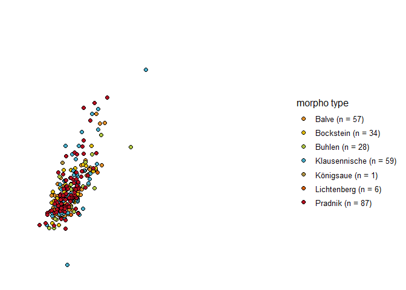<!-- -->

``` r
file_out <- paste0(file_path_sans_ext(info_in[["file"]]), "KM.width_length_morpho", ".pdf")
ggsave(filename = file_out, plot = KM.width_length_morpho, path = dir_out, device = "pdf",
       width = 170, height = 250, units = "mm")


# Pradnik scraper (complete): length-width combined with morpho type
# Load data sheet Pradnik morpho type 
PS_morpho.type <- read.xlsx(xlsxFile = data_file, sheet = 16)  
# Arranges the data and defines only the relevant rows
PS_morpho.type <- PS_morpho.type[ , ] %>% arrange(morpho.type)
PS_morpho.type <- PS_morpho.type[-54, ]


# Ascribes the N value 
n <- doBy::summaryBy(length + width ~ morpho.type, data = PS_morpho.type, FUN = length)
tag <- gsub(pattern = "_", replacement = " ", paste0(n[[1]], " (n = ", n[[2]], ")"))


# Scatterplot Keilmesser (complete): length-width combined with morpho type 
PS.width_length_morpho <- ggplot(PS_morpho.type, aes(y = length, x = width, fill = morpho.type)) +
                      geom_point(size = 2, shape = 21) +
                      labs(y = "length [mm]", x = "width [mm]", title = "", 
                           fill = "morpho type", size = 12) +
                      xlim(0, 80) + ylim(0, 80) +
                      theme_classic() +
                      scale_fill_manual(values = wes_palette(n = 5, name = "FantasticFox1",
                                          type = "continuous"), labels = tag) 
                      
print(PS.width_length_morpho)
```

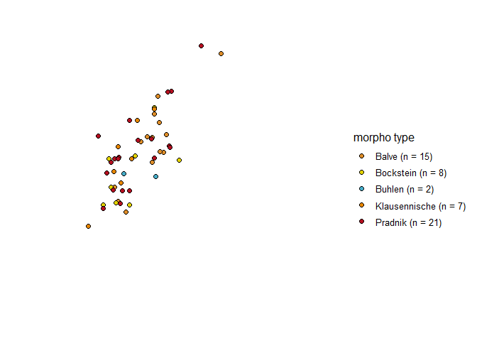<!-- -->

``` r
file_out <- paste0(file_path_sans_ext(info_in[["file"]]), "PS.width_length_morpho", ".pdf")
ggsave(filename = file_out, plot = PS.width_length_morpho, path = dir_out, device = "pdf",
       width = 170, height = 250, units = "mm")
```

## Barplot

### Morphotype

``` r
# Keilmesser morpho type 
# Load data sheet Keilmesser morpho type 
KM_morpho.type <- read.xlsx(xlsxFile = data_file, sheet = 15)  
# Defines only the rows with complete Keilmesser  
KM_morpho.type <- KM_morpho.type[1:279,]

# Barplot Keilmesser morpho type 
KM.morpho.type <- ggplot(data = KM_morpho.type) + aes(x = morpho.type, 
                                                      fill = morpho.type) + 
     geom_bar(stat = "count", width = 0.7) +
     theme_classic() +
     theme(legend.position = "none") + 
     labs(x = " ", y = "n") + 
     scale_fill_manual(values = wes_palette(n = 8 , name = "Royal1", type = "continuous"))    
 
print(KM.morpho.type)
```

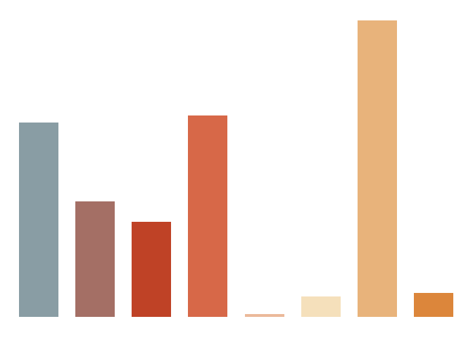<!-- -->

``` r
file_out <- paste0(file_path_sans_ext(info_in[["file"]]), "KM.morpho.type", ".pdf")
ggsave(filename = file_out, plot = KM.morpho.type, path = dir_out, device = "pdf", 
       width = 190, height = 210, units = "mm")


# Pradnik scraper morpho type 
# Load data sheet Pradnik scraper morpho type 
PS_morpho.type <- read.xlsx(xlsxFile = data_file, sheet = 16)  

# Barplot Pradnik scraper morpho type 
PS.morpho.type <- ggplot(data = PS_morpho.type) + aes(x = morpho.type, 
                                                      fill = morpho.type) + 
     geom_bar(stat = "count", width = 0.5) +
     theme_classic() +
     theme(legend.position = "none") + 
     labs(x = " ", y = "n") + 
     scale_fill_manual(values = wes_palette(n = 6, name = "Royal1", type = "continuous"))    

print(PS.morpho.type)
```

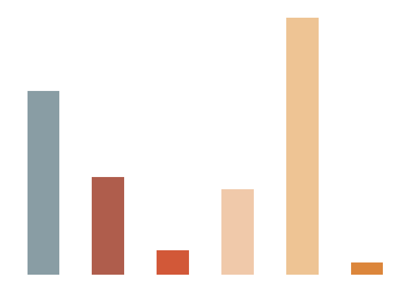<!-- -->

``` r
file_out <- paste0(file_path_sans_ext(info_in[["file"]]), "PS.morpho.type", ".pdf")
ggsave(filename = file_out, plot = PS.morpho.type, path = dir_out, device = "pdf", 
       width = 170, height = 200, units = "mm")
```

## Barplot

### Raw material

``` r
# Keilmesser raw material
# Load data sheet Keilmesser raw material
KM_raw_material <- read.xlsx(xlsxFile = data_file, sheet = 8)  

# Barplot Keilmesser raw material  
KM.raw_material <- ggplot(data = KM_raw_material) + aes(x = raw.material, 
                                                        fill = raw.material) + 
     geom_bar(stat = "count", width = 0.2) +
     theme_classic() +
     theme(legend.position = "none") + 
     labs(x = " ", y = "n") + 
     scale_x_discrete(labels=c("Baltic flint", "silicified schist")) +
     scale_fill_manual(values = wes_palette(n = 2, name = "Darjeeling2"))    
 
print(KM.raw_material)
```

<!-- -->

``` r
file_out <- paste0(file_path_sans_ext(info_in[["file"]]), "KM.raw_material", ".pdf")
ggsave(filename = file_out, plot = KM.raw_material, path = dir_out, device = "pdf")


# Pradnik scraper raw material
# Load data sheet Pradnik scraper raw material
PS_raw_material <- read.xlsx(xlsxFile = data_file, sheet = 9)  

# Barplot Pradnik scraper raw material  
PS.raw_material <- ggplot(data = PS_raw_material) + aes(x = raw.material, 
                  fill = raw.material) + 
     geom_bar(stat = "count", width = 0.2) +
     theme_classic() +
     theme(legend.position = "none") + 
     labs(x = " ", y = "n") + 
     scale_x_discrete(labels=c("Baltic flint", "silicified schist")) +
     scale_fill_manual(values = wes_palette(n = 2, name = "Darjeeling2"))    
 
print(PS.raw_material)
```

<!-- -->

``` r
file_out <- paste0(file_path_sans_ext(info_in[["file"]]), "PS.raw_material", ".pdf")
ggsave(filename = file_out, plot = PS.raw_material, path = dir_out, device = "pdf",
       width = 210, height = 150, units = "mm")


# All tool types raw material
# Load data sheet all tool types raw material
all_raw_material <- read.xlsx(xlsxFile = data_file, sheet = 1)  

# Barplot Pradnik scraper raw material  
all.raw_material <- ggplot(data = all_raw_material) + aes(x = raw.material, 
                                          fill = raw.material) + 
     geom_bar(stat = "count", width = 0.2) +
     theme_classic() +
     theme(legend.position = "none") + 
     labs(x = " ", y = "n") + 
     scale_x_discrete(labels=c("Baltic flint", "silicified schist")) +
     scale_fill_manual(values = wes_palette(n = 2, name = "Darjeeling2"))    
 
print(all.raw_material)
```

<!-- -->

``` r
file_out <- paste0(file_path_sans_ext(info_in[["file"]]), "all.raw_material", ".pdf")
ggsave(filename = file_out, plot = all.raw_material, path = dir_out, device = "pdf")
```

## Barplot

### Morphology back

``` r
# Keilmesser morphology back 
# Load data sheet Keilmesser raw material
KM_back <- read.xlsx(xlsxFile = data_file, sheet = 13)  

# Barplot Keilmesser raw material  
KM.back_morpho <- ggplot(data = KM_back) + aes(x = morphology.back, fill = morphology.back) + 
     geom_bar(stat = "count", width = 0.5) +
     theme_classic() +
     theme(legend.position = "none") + 
     labs(x = " ", y = "n") + 
     scale_x_discrete(labels=c("cortex + partly retouched", "cortex/unworked", "N/A",
                               "partly retouched", "retouched")) +
     scale_fill_manual(values = wes_palette(n = 7, name = "Darjeeling2", 
                                            type = "continuous"))    
 
print(KM.back_morpho)
```

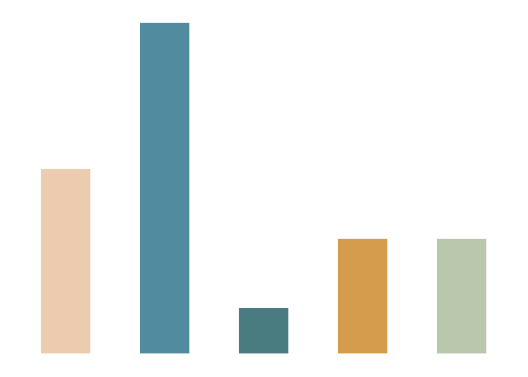<!-- -->

``` r
file_out <- paste0(file_path_sans_ext(info_in[["file"]]), "KM.back_morpho", ".pdf")
ggsave(filename = file_out, plot = KM.back_morpho, path = dir_out, device = "pdf",
       width = 250, height = 170, units = "mm")


# Pradnik scraper morphology back 
# Load data sheet Pradnik scraper raw material
PS_back <- read.xlsx(xlsxFile = data_file, sheet = 14)  

# Barplot Pradnik scraper raw material  
PS.back_morpho <- ggplot(data = PS_back) + aes(x = morphology.back, 
                                        fill = morphology.back) + 
     geom_bar(stat = "count", width = 0.4) +
     theme_classic() +
     theme(legend.position = "none") + 
     labs(x = " ", y = "n") + 
     scale_x_discrete(labels=c("cortex + partly retouched", "cortex/unworked", 
                               "partly retouched", "retouched")) +
     scale_fill_manual(values = wes_palette(n = 7, name = "Darjeeling2", 
                                            type = "continuous"))    
 
print(PS.back_morpho)
```

<!-- -->

``` r
file_out <- paste0(file_path_sans_ext(info_in[["file"]]), "PS.back_morpho", ".pdf")
ggsave(filename = file_out, plot = PS.back_morpho, path = dir_out, device = "pdf", 
       width = 250, height = 170, units = "mm")


# Keilmesser blanks
# Load data sheet Keilmesser blanks 
KM_cortex_blanks <- read.xlsx(xlsxFile = data_file, sheet = 11)  

# Barplot Keilmesser blanks 
KM.cortex_blanks <- ggplot(data = KM_cortex_blanks) + aes(x = blank, fill = cortex) + 
     geom_bar(stat = "count", width = 0.3) +
     theme_classic() +
     labs(x = " ", y = "n") + 
     scale_x_discrete(labels=c("core", "flake", "N/A")) +
     scale_fill_manual(values = wes_palette(n = 7, name = "Darjeeling2", 
                                            type = "continuous"))    
 
print(KM.cortex_blanks)
```

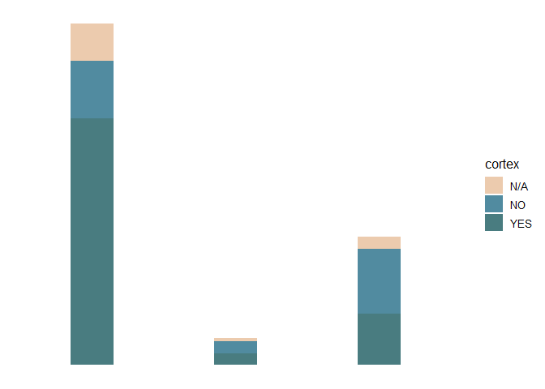<!-- -->

``` r
file_out <- paste0(file_path_sans_ext(info_in[["file"]]), "KM.cortex_blanks", ".pdf")
ggsave(filename = file_out, plot = KM.cortex_blanks, path = dir_out, device = "pdf", 
       width = 250, height = 170, units = "mm")


# Pradnik scraper blanks
# Load data sheet Pradnik scraper blanks 
PS_cortex_blanks <- read.xlsx(xlsxFile = data_file, sheet = 12)  

# Barplot Pradnik scraper blanks 
PS.cortex_blanks <- ggplot(data = PS_cortex_blanks) + aes(x = blank, fill = cortex) + 
     geom_bar(stat = "count", width = 0.25) +
     theme_classic() +
     labs(x = " ", y = "n") + 
     scale_x_discrete(labels=c("core", "flake", "N/A")) +
     scale_fill_manual(values = wes_palette(n = 7, name = "Darjeeling2", 
                                            type = "continuous"))    
 
print(PS.cortex_blanks)
```

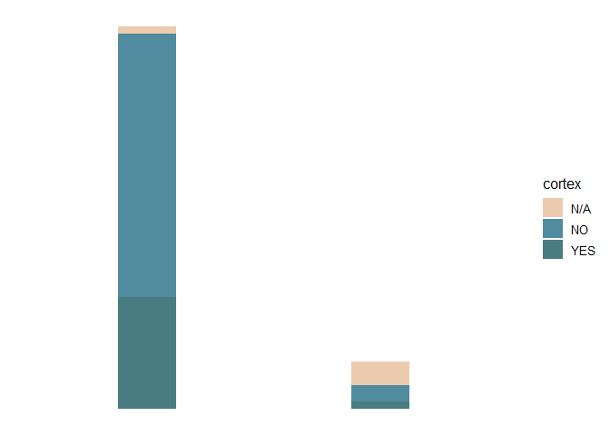<!-- -->

``` r
file_out <- paste0(file_path_sans_ext(info_in[["file"]]), "PS.cortex_blanks", ".pdf")
ggsave(filename = file_out, plot = PS.cortex_blanks, path = dir_out, device = "pdf", 
       width = 250, height = 170, units = "mm")
```

## Barplot

### Pradnik method

``` r
# Keilmesser application Pradnik method
# Load data sheet Keilmesser Pradnik method
KM_Pradnik.method <- read.xlsx(xlsxFile = data_file, sheet = 17)  

# Barplot Keilmesser Pradnik method 
KM.PM <- ggplot(data = KM_Pradnik.method) + aes(x = application.Pradnikmethod, 
                 fill = application.Pradnikmethod) + 
     geom_bar(stat = "count", width = 0.3) + 
     theme_classic() +
     labs(x = " ", y = "n") + 
     theme(legend.position = "none") + 
     scale_x_discrete(labels=c("no", "N/A", "yes")) +
     scale_fill_manual(values = wes_palette(n = 5, name = "GrandBudapest1", 
                                            type = "continuous"))    
 
print(KM.PM)
```

<!-- -->

``` r
file_out <- paste0(file_path_sans_ext(info_in[["file"]]), "KM.PM", ".pdf")
ggsave(filename = file_out, plot = KM.PM, path = dir_out, device = "pdf",  
       width = 250, height = 170, units = "mm")
```

## Diverging barplot

### Lateralisation

``` r
# Keilmesser lateralisation
# Load data sheet Keilmesser lateralisation
KM_lateralisation <- read.xlsx(xlsxFile = data_file, sheet = 19)  
KM_lateralisation[grep("sin.", KM_lateralisation[["tool.lateralisation"]]), "value"] <-
  "-1"
KM_lateralisation[grep("dex.", KM_lateralisation[["tool.lateralisation"]]), "value"] <- 
  "1"
# Defines only the rows with complete Keilmesser  
KM_lateralisation <- KM_lateralisation[1:279,]

# Barplot Keilmesser lateralisation
KM.lat <- ggplot(KM_lateralisation, aes(y = value, x = technological.class, 
                                        fill = tool.lateralisation)) + 
          geom_bar(stat = "identity", width = 0.15) +
          theme_minimal() +
          labs(x = NULL, y = NULL) +
          theme(axis.text.x = element_blank(), axis.text.y = element_blank()) +
          scale_fill_manual(values = wes_palette(n = 5, name = "Darjeeling2", 
                                                 type = "continuous")) + 
          guides(fill = guide_legend(reverse=TRUE)) +
          labs(fill = "tool lateralisation") +
          coord_flip() 

print(KM.lat)
```

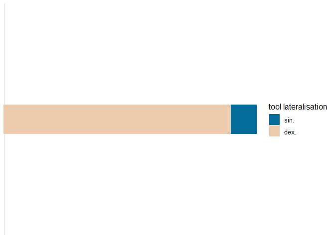<!-- -->

``` r
file_out <- paste0(file_path_sans_ext(info_in[["file"]]), "KM.lat", ".pdf")
ggsave(filename = file_out, plot = KM.lat, path = dir_out, device = "pdf")


# Pradnik scraper lateralisation
# Load data sheet Pradnik scraper lateralisation
PS_lateralisation <- read.xlsx(xlsxFile = data_file, sheet = 20)  
PS_lateralisation <- PS_lateralisation [-c(37, 43), ]
PS_lateralisation[grep("sin.", PS_lateralisation[["tool.lateralisation"]]), "value"] <-
  "-1"
PS_lateralisation[grep("dex.", PS_lateralisation[["tool.lateralisation"]]), "value"] <- 
  "1"

# Barplot Pradnik scraper lateralisation
PS.lat <- ggplot(PS_lateralisation, aes(y = value, x = technological.class, 
                                        fill = tool.lateralisation)) + 
          geom_bar(stat = "identity", width = 0.15) +
          theme_minimal() +
          labs(x = NULL, y = NULL) +
          theme(axis.text.x = element_blank(), axis.text.y = element_blank()) +
          scale_fill_manual(values = wes_palette(n = 5, name = "Darjeeling2", 
                                                 type = "continuous")) + 
          guides(fill = guide_legend(reverse=TRUE)) +
          labs(fill = "tool lateralisation") +
          coord_flip() 

print(PS.lat)
```

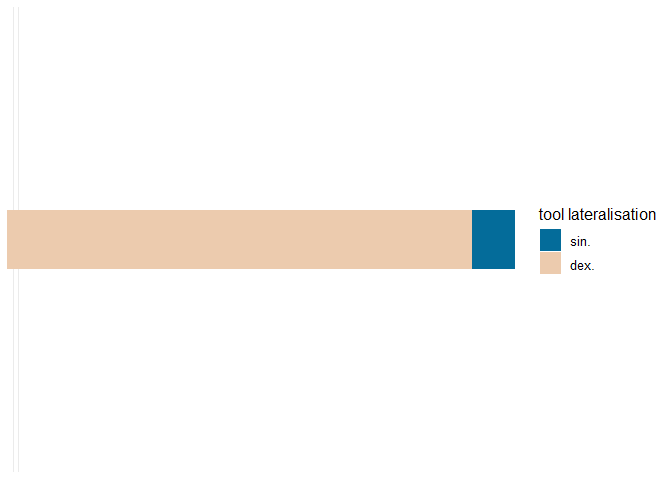<!-- -->

``` r
file_out <- paste0(file_path_sans_ext(info_in[["file"]]), "PS.lat", ".pdf")
ggsave(filename = file_out, plot = PS.lat, path = dir_out, device = "pdf")
```

## Barplot

### Barplot lateral resharpening spall type

``` r
# Lateral resharpening spall type
# Load data sheet lateral resharpening spall type
LSS_type <- read.xlsx(xlsxFile = data_file, sheet = 21)  

# Barplot lateral resharpening spall type
LSS.type <- ggplot(data = LSS_type) + aes(x = type.lateral.sharpening.spall, 
                                          fill = tool.lateralisation) + 
     geom_bar(stat = "count", width = 0.2) + 
     theme_classic() +
     labs(x = " ", y = "n") + 
     labs(fill = "tool lateralisation") +
     scale_x_discrete() +
     scale_fill_manual(values = wes_palette(n = 5, name = "GrandBudapest1", 
                                            type = "continuous"))    
 
print(LSS.type)
```

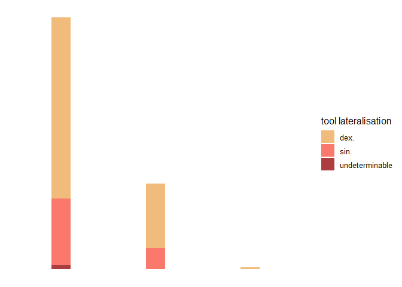<!-- -->

``` r
file_out <- paste0(file_path_sans_ext(info_in[["file"]]), "LSS.type", ".pdf")
ggsave(filename = file_out, plot = LSS.type, path = dir_out, device = "pdf")
```

## Ternary plot

### Perimeter

``` r
library(ggtern)
# Perimeter Keilmesser 
# Load data sheet Keilmesser perimeter
KM_perimeter <- read.xlsx(xlsxFile = data_file, sheet = 6) 
# Defines only the rows with complete Keilmesser 
KM_perimeter <- KM_perimeter[1:278, ]
KM_perimeter <- KM_perimeter[ , ] %>% arrange(morpho.type)
KM_perimeter <- KM_perimeter[-c(273:278), ]

# Ternary diagram Keilmesser perimeter
KM.perimeter  <- ggtern(data = KM_perimeter, aes(x = perimeter.distal.posterior.part, 
                                                 y = perimeter.active.edge, 
                                                 z = perimeter.basis.back)) +
                 geom_point(aes(colour = morpho.type)) +
                 theme_bw() +
                 scale_colour_startrek() +
                 theme_hidetitles() +
                 theme_showarrows() +
                 xlab("distal posterior part")+ 
                 ylab("active edge")+
                 zlab("basis + back")+ 
                 labs(colour = "morpho type") +
                 tern_limits(labels=c(0, 20, 40, 60, 80, 100)) +
                 theme_rotate(degrees = 330)
                

print(KM.perimeter) 
```

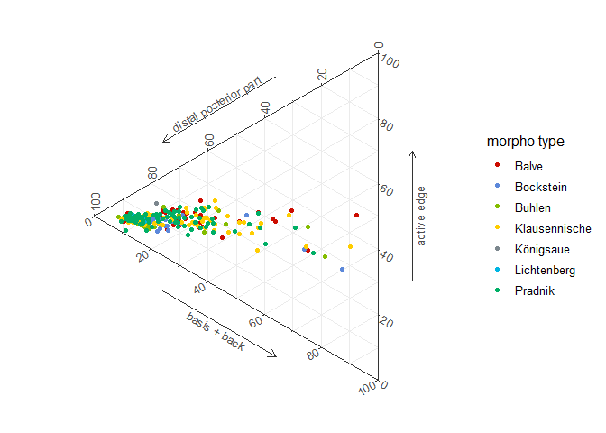<!-- -->

``` r
file_out <- paste0(file_path_sans_ext(info_in[["file"]]), "KM.perimeter", ".pdf")
ggsave(filename = file_out, plot = KM.perimeter, path = dir_out, device = "pdf")


# Perimeter Pradnik scraper
# Load data sheet Pradnik scraper perimeter
PS_perimeter <- read.xlsx(xlsxFile = data_file, sheet = 7) 
PS_perimeter <- PS_perimeter[ , ] %>% arrange(morpho.type)
PS_perimeter <- PS_perimeter[-c(54), ]

# Ternary diagram Pradnik scraper perimeter
PS.perimeter  <- ggtern(data = PS_perimeter, aes(x = perimeter.distal.posterior.part, 
                                                 y = perimeter.active.edge, 
                                                 z = perimeter.basis.back)) +
                 geom_point(aes(colour = morpho.type)) +
                 theme_bw() +
                 scale_colour_startrek() +
                 theme_hidetitles() +
                 theme_showarrows() +
                 xlab("arch")+ 
                 ylab("active edge")+
                 zlab("basis + back")+ 
                 labs(colour = "morpho type") +
                 tern_limits(labels=c(0, 20, 40, 60, 80, 100)) +
                 theme_rotate(degrees = 330)
                

print(PS.perimeter) 
```

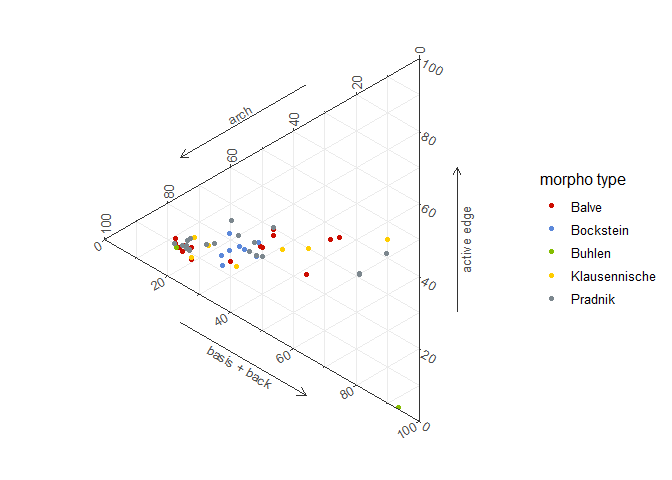<!-- -->

``` r
file_out <- paste0(file_path_sans_ext(info_in[["file"]]), "PS.perimeter", ".pdf")
ggsave(filename = file_out, plot = PS.perimeter, path = dir_out, device = "pdf")
```

-----

# Show plot files information

``` r
info_out <- list.files(path = dir_out, pattern = "\\.pdf$", full.names = TRUE) %>% 
            md5sum()
```

The checksum (MD5 hashes) of the exported files are:

``` 
      analysis/all_sites/plots/all.raw_material.pdf 
                 "70608c136477e3769d3462def5de659c" 
               analysis/all_sites/plots/KM.back.pdf 
                 "7827c56843a94d7a8e26f9d21330223c" 
        analysis/all_sites/plots/KM.back_morpho.pdf 
                 "dda5d48df1c0b6ae85261de49a0b1c64" 
      analysis/all_sites/plots/KM.cortex_blanks.pdf 
                 "1904a564397622a84ef912c2347f3f1c" 
                analysis/all_sites/plots/KM.lat.pdf 
                 "3804f322323b4afccecff5aa7d25ef56" 
             analysis/all_sites/plots/KM.length.pdf 
                 "d93719e5ea0e8e7137978adda8c90d00" 
       analysis/all_sites/plots/KM.length_width.pdf 
                 "2a70514576f8f19f66fc7c6357ef6925" 
        analysis/all_sites/plots/KM.morpho.type.pdf 
                 "5cacdc8f9043860f13d6b7cd733f37b0" 
          analysis/all_sites/plots/KM.perimeter.pdf 
                 "09da55d59e5a12aca04daec49becd10a" 
                 analysis/all_sites/plots/KM.PM.pdf 
                 "479435ac4037f461dab04bd43613992f" 
    analysis/all_sites/plots/KM.PS.length_width.pdf 
                 "6f01a3f87da7ad0da10be0b5b67e9128" 
       analysis/all_sites/plots/KM.raw_material.pdf 
                 "aa2be7a5a6ea9aa9ef002ddde97402fb" 
          analysis/all_sites/plots/KM.thickness.pdf 
                 "7827c56843a94d7a8e26f9d21330223c" 
   analysis/all_sites/plots/KM.tip.length_width.pdf 
                 "855bfe3175cea6ce66e924b4c0e73f3f" 
              analysis/all_sites/plots/KM.width.pdf 
                 "d93719e5ea0e8e7137978adda8c90d00" 
analysis/all_sites/plots/KM.width_length_morpho.pdf 
                 "804e66e887eeef398cfad189e12d1f6d" 
            analysis/all_sites/plots/LSS.length.pdf 
                 "891f1f6ad9484b08a8fe0d1369148751" 
      analysis/all_sites/plots/LSS.length_width.pdf 
                 "2ef07a30c20ad120c999305f1ae440d2" 
         analysis/all_sites/plots/LSS.thickness.pdf 
                 "1fd885ccf33e65c2df5bea7e1042b798" 
              analysis/all_sites/plots/LSS.type.pdf 
                 "f2f5dcbdb3902c861ff19f3f6e34d0da" 
             analysis/all_sites/plots/LSS.width.pdf 
                 "891f1f6ad9484b08a8fe0d1369148751" 
               analysis/all_sites/plots/PS.back.pdf 
                 "1fd885ccf33e65c2df5bea7e1042b798" 
        analysis/all_sites/plots/PS.back_morpho.pdf 
                 "64d7f74d459de66fba5fd5869054a12d" 
      analysis/all_sites/plots/PS.cortex_blanks.pdf 
                 "46a20b204c72695d3cc1216294da6ad4" 
                analysis/all_sites/plots/PS.lat.pdf 
                 "4a04427c525e948a5f31229fff2dbd78" 
             analysis/all_sites/plots/PS.length.pdf 
                 "891f1f6ad9484b08a8fe0d1369148751" 
       analysis/all_sites/plots/PS.length_width.pdf 
                 "656e5ec0d6143530cddae572d6442c9e" 
        analysis/all_sites/plots/PS.morpho.type.pdf 
                 "b47dc8914160c117666d76761076f86f" 
          analysis/all_sites/plots/PS.perimeter.pdf 
                 "9dd61419e41f80e47df0f9d4a2135c3e" 
       analysis/all_sites/plots/PS.raw_material.pdf 
                 "5d66b1dabc8d26c212b49c949bcef5ca" 
          analysis/all_sites/plots/PS.thickness.pdf 
                 "1fd885ccf33e65c2df5bea7e1042b798" 
              analysis/all_sites/plots/PS.width.pdf 
                 "891f1f6ad9484b08a8fe0d1369148751" 
analysis/all_sites/plots/PS.width_length_morpho.pdf 
                 "7b3a3074f44db4d3ff80a23b7be836fb" 
```

-----

# sessionInfo() and RStudio version

``` r
sessionInfo()
```

``` 
R version 4.0.2 (2020-06-22)
Platform: x86_64-w64-mingw32/x64 (64-bit)
Running under: Windows 10 x64 (build 19041)

Matrix products: default

locale:
[1] LC_COLLATE=German_Germany.1252  LC_CTYPE=German_Germany.1252   
[3] LC_MONETARY=German_Germany.1252 LC_NUMERIC=C                   
[5] LC_TIME=German_Germany.1252    

attached base packages:
[1] tools     stats     graphics  grDevices utils     datasets  methods  
[8] base     

other attached packages:
 [1] ggtern_3.3.0      ggsci_2.9         dplyr_1.0.2       wesanderson_0.3.6
 [5] ggplot2_3.3.2     chron_2.3-56      R.utils_2.10.1    R.oo_1.24.0      
 [9] R.methodsS3_1.8.1 readxl_1.3.1      openxlsx_4.1.5   

loaded via a namespace (and not attached):
 [1] tidyselect_1.1.0   xfun_0.16          purrr_0.3.4        lattice_0.20-41   
 [5] latex2exp_0.4.0    colorspace_1.4-1   vctrs_0.3.4        generics_0.0.2    
 [9] doBy_4.6.7         htmltools_0.5.0    compositions_2.0-0 yaml_2.2.1        
[13] rlang_0.4.7        pillar_1.4.6       glue_1.4.2         withr_2.2.0       
[17] lifecycle_0.2.0    plyr_1.8.6         robustbase_0.93-6  stringr_1.4.0     
[21] munsell_0.5.0      gtable_0.3.0       cellranger_1.1.0   zip_2.1.1         
[25] evaluate_0.14      labeling_0.3       knitr_1.29         DEoptimR_1.0-8    
[29] proto_1.0.0        broom_0.7.0        Rcpp_1.0.5         scales_1.1.1      
[33] backports_1.1.9    farver_2.0.3       Deriv_4.0.1        gridExtra_2.3     
[37] tensorA_0.36.1     digest_0.6.25      stringi_1.5.3      grid_4.0.2        
[41] rprojroot_1.3-2    magrittr_1.5       tibble_3.0.3       crayon_1.3.4      
[45] tidyr_1.1.2        pkgconfig_2.0.3    bayesm_3.1-4       ellipsis_0.3.1    
[49] MASS_7.3-51.6      Matrix_1.2-18      rmarkdown_2.3      R6_2.4.1          
[53] compiler_4.0.2    
```

RStudio version 1.3.1073.

-----

END OF SCRIPT
